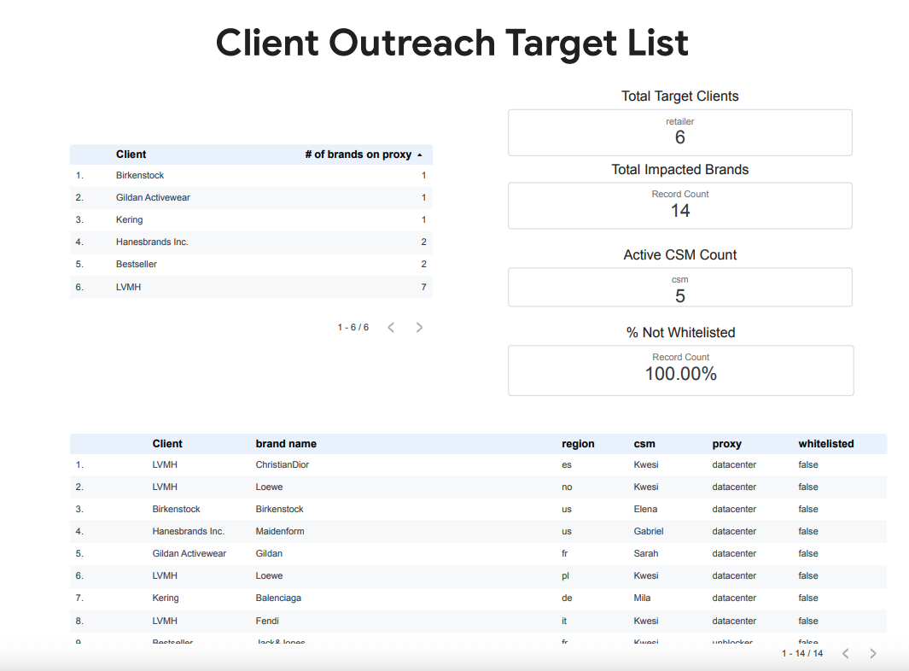

### Proxy Cost Savings Analysis | dbt core, BigQuery, SQL, Data Studio (Looker Studio)

#### Summary:
This project transforms a manual, error-prone gap analysis process into a fully automated, modular ELT pipeline. The objective is to identify high-cost web crawlers that are utilizing third-party proxies due to lack of client whitelisting. By isolating these targets, the customer success team can leverage existing relationships to implement direct whitelisting headers, resulting in a direct reduction of third-party proxy costs.

#### Business Impact:
  - Cost Reduction: Automatically isolates and outputs target clients responsible for high-cost proxy consumption.
  - Operational Efficiency: Eliminates manual spreadsheet joins and ad-hoc analysis, ensuring data freshness through an automated daily execution schedule.
  - Actionable Insights: Generates a prioritized, strictly tested outreach list for customer success team to execute whitelisting requests.
    

#### Data Architecture & Modeling:

This pipeline follows a modular, three-tier architecture designed for scalability and maintainability within BigQuery. 

  - Ingestion: Connects directly to live Google Sheets via BigQuery external tables, bypassing the need for static CSV uploads.
  - Staging Layer (`stg_`): Cleans and standardizes raw CSV data from Google Sheets. Handles renaming, type casting, and initial filtering to ensure a clean starting point and so downstream joins do not silently drop records.
  - Intermediate Layer (`int_`): Performs core business logic and joins (`int_proxy_exception`) with client metadata to isolate high-cost proxy dependent crawlers.
  - Marts Layer (`fct_`, `dim_`):
    - fct_outreach_target_list: This is the centralized fact table used for reporting and outreach prioritization.
    - dim_retailers: This is a dimension table that provides the single source of truth for retailer attributes. 

#### Key Features:
  - CI/CD Orchestration: The pipeline is orchestrated via GitHub Actions. A daily cron schedule securely authenticates to Google Cloud via Service Accounts to execute the dbt build command, ensuring zero-maintenance data freshness.
  - Modular Logic: Decoupled transformations for maintainability and reusibility.
  - Data Quality: Data integrity tests are enforced at the staging layer to catch formatting errors and nulls before they can corrupt downstream metrics.
  - Star Schema Design: Designed the final marts to isolate facts from descriptive dimensions, allowing for performance and streamlined architecture within BigQuery.

#### Final Data Product: Stakeholder Dashboard:

#### Optimization of BI Layer:
This dashboard simulates the final stakeholder handoff to the customer success team. The result of completing the data cleaning, joins and logic filtering in the upstream transformation layers, this Data Studio (Looker) dashboard requires zero custom calculated fields. 

By serving the visualization tool a clean, pre-aggregated Star Schema (`fct_outreach_target_list` and `dim_retailers`), the architecture guarantees:
1. reduced load times and filtered performance for non-technical end users.
2. A single source of truth that ensures the KPIs on the dashboard always match the underlying BigQuery data warehouse. 
